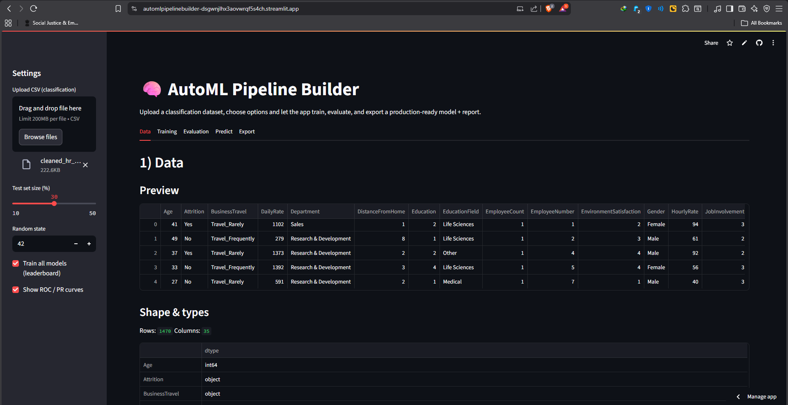

# 🧠 AutoML Pipeline Builder

A user-friendly Streamlit application that allows anyone to train and evaluate machine learning models on **any classification dataset** — no coding required.

---

## 🚀 Features

- 📁 Upload your own CSV classification dataset
- 🎯 Choose target column dynamically
- ⚙️ Select model:  
  - Logistic Regression  
  - Random Forest  
  - XGBoost  
  - K-Nearest Neighbors  
  - Support Vector Machine
- 🔄 Automatic preprocessing: label encoding, scaling, train-test split
- 📊 Performance outputs:  
  - Classification report  
  - Confusion matrix (heatmap)  
  - ROC AUC score
- 📤 **Export trained model** (model, scaler, and feature order)
- 📉 **Upload your own test data** and get real-time predictions

---

## 🧪 Tech Stack

- Python
- Scikit-learn
- XGBoost
- Streamlit
- Seaborn / Matplotlib
- Joblib (for model export)

---

## 🖼️ App Preview

---

## ⚙️ Installation & Usage

### 1️⃣ Install Requirements

```bash
pip install streamlit scikit-learn pandas xgboost seaborn matplotlib joblib
```

### 📈 Sample Output
```
Confusion Matrix:
[[362  11]
 [ 29  30]]

Classification Report:
              precision    recall  f1-score
Attrition 1     0.73       0.51     0.60

ROC AUC Score: 0.91
```

### 🧾 Project Structure
```bash
.
├── dataset/
│   └── WA_Fn-UseC_-HR-Employee-Attrition.csv
├── hr_attrition_multimodel.py       # Trains & evaluates all models
├── hr_attrition_ui.py               # Streamlit-based prediction UI
├── requirements.txt
└── README.md
```

## 📚 Useful Concepts Covered
- SMOTE (Synthetic Minority Over-sampling)
- Multi-model comparison
- Feature scaling and label encoding
- VotingClassifier (soft voting)
- UI deployment using Streamlit

## 📜 License
- MIT © 2025 Mayank Raval
---
